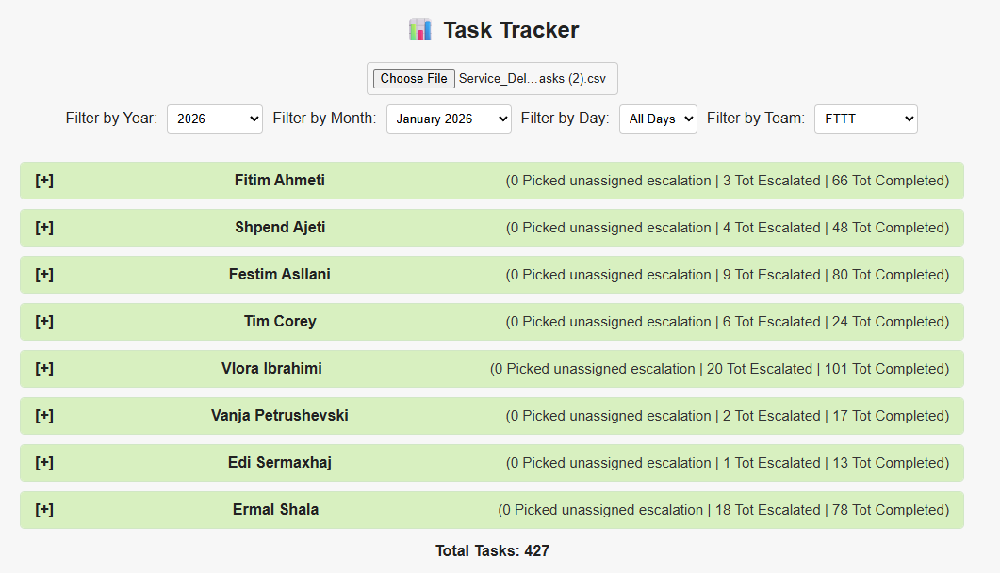
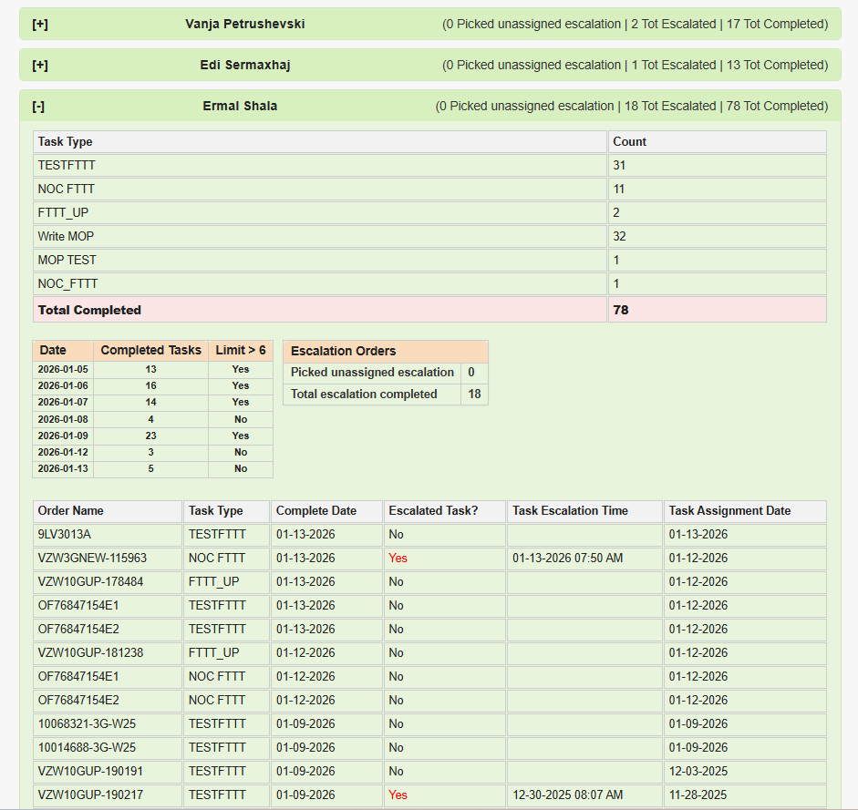

# SDAPP Task Tracker

A small, simple dashboard that helps me review completed SDAPP tasks from a CSV export — without needing Excel pivot tables.

You upload a CSV file, pick **Year / Month / Day / Team**, and the page groups the results by **Task Owner**. Each owner section can be expanded to see:
- a quick **Task Type** summary,
- **escalation stats**, and
- a **per-day completion** check (with a limit flag).

## What it does

- Uploads a CSV file in the browser (no backend)
- Filters by:
  - **Year**
  - **Month** (e.g. “January 2026”)
  - **Day** (optional)
  - **Team** (FTTT / Data / CDE, based on a local team mapping)
- Groups tasks by **Task Owner** (it also cleans names like `Name <id>` → `Name`)
- For each owner, shows:
  - **Task Type breakdown** + **Total Completed**
  - **Escalation Orders**:
    - `Picked unassigned escalation` (assignment date is after escalation time)
    - `Total escalation completed`
  - **Per-day completion table** with a flag: **Limit > 6**
  - A detailed table with:
    - Order name (Customer PON)
    - Task Type
    - Actual Complete Date
    - Escalated Task?
    - Task Escalation Time
    - Task Assignment Date

## Screenshots

### Dashboard overview

### Team member details (expanded view)

## How to run

1. Clone the repo
2. Open `index.html` in your browser (double-click works)
3. Upload your CSV file using the file input

That’s it — there are no build steps.

## CSV columns the tracker expects

The page reads these headers from the CSV (case-sensitive as exported):

- `Actual Complete Date`
- `Task Owner`
- `Task Type`
- `Service Delivery Order - Customer PON`
- `Escalated Task?` **or** `Service Delivery Order - Escalated Order?`
- `Task Escalation Time`
- `Task Assignment Date`

If `Actual Complete Date` or `Task Owner` is missing, the row is ignored.

## Notes / small quirks (good to know)

- The **Year filter** is required (it defaults to the current year if that year exists in the CSV).
- The **Month dropdown** defaults to the latest month found in the data.
- “Picked unassigned escalation” is counted when:
  - the task is escalated, and
  - `Task Assignment Date` is after `Task Escalation Time`
- The per-day “Limit > 6” flag is a simple check: completed tasks per day **greater than 6**.

## Tech

- Plain **HTML / CSS / JavaScript**
- CSV parsing via **PapaParse** (CDN)
- Runs fully client-side

